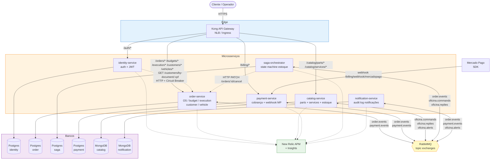
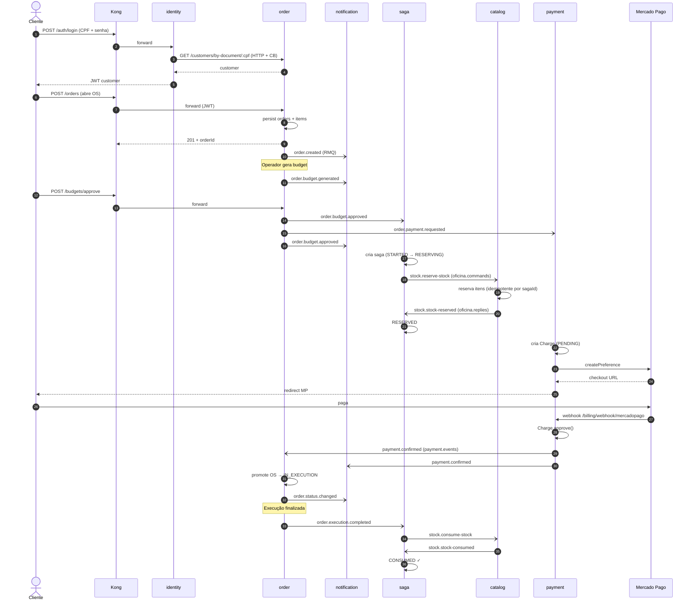

# Arquitetura — autoflow

## Visão geral

O **autoflow** é o sistema de gestão de uma oficina mecânica, decomposto em **6 microsserviços NestJS** que se comunicam via **HTTP síncrono** (consultas) e **RabbitMQ assíncrono** (eventos de domínio). Persistência heterogênea: Postgres para serviços transacionais, MongoDB para catálogo e auditoria.

---

## Diagrama de componentes



---

## Fluxo end-to-end de uma OS (happy path)



---

## Bancos por serviço

| Serviço             | Banco       | Por quê                                                              |
|---------------------|-------------|----------------------------------------------------------------------|
| identity            | Postgres    | Admins (entidade pequena, relacional). Customer fica no order.       |
| order               | Postgres    | OS + items + status_history + budgets + customers + vehicles. Modelo fortemente normalizado, integridade transacional (ACID) crítica. |
| saga-orchestrator   | Postgres    | Estado da saga (sagaId, status, transitions). Índice único em `sagaId` garante idempotência. |
| payment             | Postgres    | Charges + webhook_events. Auditoria + integridade financeira.        |
| catalog             | MongoDB     | Peças têm atributos heterogêneos por categoria (filtro de óleo vs pneu têm campos diferentes). NoSQL schema-on-read evita EAV ou nullables. |
| notification        | MongoDB     | Audit log append-only de eventos. Schema simples + alto volume.      |

**Isolamento:** cada serviço acessa **somente o próprio banco** — não há cross-database queries. Acesso a dados de outros serviços é sempre via API.

---

## Mensageria (RabbitMQ topic exchanges)

| Exchange            | Produtores                | Consumidores                       | Routing keys                                                                |
|---------------------|---------------------------|------------------------------------|------------------------------------------------------------------------------|
| `order.events`      | order                     | saga, payment, notification        | `order.created`, `order.status.changed`, `order.budget.generated`, `order.budget.approved`, `order.budget.rejected`, `order.payment.requested`, `order.execution.completed`, `order.cancelled` |
| `payment.events`    | payment                   | order, notification                | `payment.confirmed`, `payment.failed`, `payment.refunded`                    |
| `oficina.commands`  | saga                      | catalog                            | `stock.reserve-stock`, `stock.consume-stock`, `stock.release-reservation`    |
| `oficina.replies`   | catalog                   | saga                               | `stock.stock-reserved`, `stock.stock-insufficient`, `stock.stock-consumed`, `stock.reservation-released` |
| `oficina.alerts`    | catalog                   | notification                       | `stock.low-stock-alert`                                                      |
| `oficina.dlx`       | (DLQ — automático)        | catalog (dlq.consumer)             | `<queue-name>.dlq`                                                           |

Todas as exchanges são `topic` + `durable: true`. Filas de consumer têm DLQ via `x-dead-letter-exchange` com 3 retries + backoff exponencial (1s, 5s, 25s).

**Envelope canônico:**
```json
{
  "eventId": "uuid-v4",
  "correlationId": "x-correlation-id propagado",
  "sagaId": "uuid (apenas em eventos saga)",
  "occurredAt": "ISO-8601",
  "version": "1.0",
  "source": "order-service | catalog-service | ...",
  "payload": { ... }
}
```

---

## Camada de Edge (Kong)

- **NLB** AWS (em produção) ou Service `LoadBalancer` no kind (local).
- Kong em modo **DB-less** (config declarativa via YAML).
- Roteamento por prefixo de path; sem autorização no Kong — JWT validado dentro de cada serviço (`@nestjs/jwt`) reutilizando o mesmo `JWT_SECRET` emitido pelo `identity-service`.

---

## Observabilidade

- **APM**: New Relic agent em cada container (eventos `Transaction` e `TransactionError` via instrumentação automática Nest).
- **Logs canônicos**: 1 entrada por request HTTP **e** por evento RMQ processado, com `correlationId`, `request_id`, `sagaId`, `orderId` etc. Saída em JSON estruturado.
- **Custom events**: 11 tipos via `recordCustomEvent('AutoflowBizEvent', ...)` — `OrderCreated`, `OrderStatusChanged`, `OrderCancelled`, `BudgetApproved`, `ExecutionCompleted`, `SagaReserved`, `SagaReservationFailed`, `SagaConsumed`, `SagaCompensation`, `StockReserved`, `StockInsufficient`, `StockConsumed`, `StockLowAlert`, `ChargeCreated`, `PaymentApproved`, `PaymentRejected`.
- Dashboard configurado em [`observability/dashboard.json`](../observability/dashboard.json).

---

## Deploy

- **Local**: kind cluster via `local/bootstrap.sh` (~5 min do zero). Acesso por Kong NLB exposto em `localhost:8080`.
- **AWS**: EKS no AWS Academy Lab via `scripts/aws-lab-deploy.sh`. RDS Postgres + MongoDB StatefulSet + RabbitMQ no cluster + Kong com NLB.
- **CI/CD**: GitHub Actions por repo. CI roda em qualquer branch (`ci.yml`). CD dispara via `workflow_run` apenas em `main` (`cd.yml`) → build da imagem → push no DockerHub → rollout no EKS.

Ver também:
- [02-saga-pattern.md](./02-saga-pattern.md) — escolha entre orquestração e coreografia
- [03-design-decisions.md](./03-design-decisions.md) — justificativas de divisão e stack
