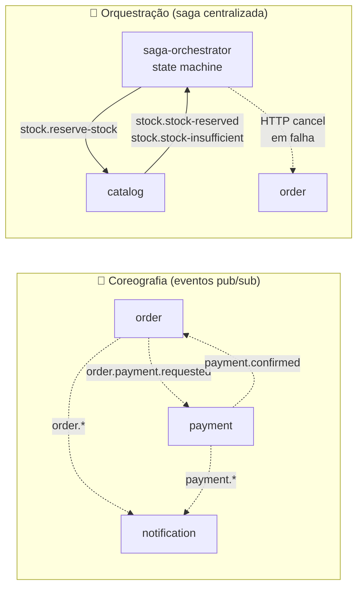

# Saga Pattern — estratégia escolhida

## TL;DR

O autoflow usa um **modelo híbrido**:

- **Coreografia** para o fluxo principal de negócio (OS → orçamento → cobrança → pagamento → notificação).
- **Orquestração** para o sub-fluxo de **controle de estoque** (reservar → consumir → liberar), que exige **compensação** garantida em caso de falha.

A escolha não é "uma ou outra" — cada parte do sistema tem requisitos diferentes, e aplicar uma única estratégia uniforme resultaria em código mais complexo ou em garantias mais fracas.

---

## Onde cada estratégia atua



### Coreografia — o que e por quê

**Eventos coreográficos** (cada serviço escuta o que lhe interessa, sem coordenador):

| Evento (routing key)          | Produtor  | Consumidor(es)            | Ação no consumidor                                |
|-------------------------------|-----------|---------------------------|---------------------------------------------------|
| `order.payment.requested`     | order     | payment                   | cria `Charge` + gera preferência MP               |
| `payment.confirmed`           | payment   | order, notification       | promove OS → IN_EXECUTION / persiste notificação  |
| `payment.failed`              | payment   | order, notification       | mantém OS em AWAITING_PAYMENT / notifica          |
| `order.created`               | order     | notification              | persiste audit log                                |
| `order.budget.generated/approved/rejected` | order | notification        | persiste audit log                                |
| `order.cancelled`             | order     | saga, notification        | saga compensa estoque (RELEASING)                 |
| `stock.low-stock-alert`       | catalog   | notification              | alerta operacional                                |

**Por que coreografia aqui:**

- **Acoplamento baixo**: `order` não precisa saber que `notification` existe. Adicionar um novo consumidor (ex: serviço de e-mail marketing) é apenas mais um `@RabbitSubscribe` — zero mudança nos publishers.
- **Não há compensação distribuída** nesse fluxo: se o e-mail de notificação falhar, isso não invalida a OS já paga. Cada efeito colateral é independente e idempotente.
- **Performance**: nada de hop extra por um orquestrador para algo que poderia ser fan-out direto do broker.

### Orquestração — o que e por quê

**Sub-fluxo de estoque** (saga-orchestrator coordena via state machine):

```
order.budget.approved
   ↓
STARTED ──→ RESERVING ──(stock.reserve-stock)──→ catalog
                                                  ↓
                                       stock.stock-reserved  →  RESERVED
                                       stock.stock-insufficient → RESERVATION_FAILED
                                                                      ↓
                                                              PATCH /orders/:id/cancel
                                                                      ↓
                                                              order.cancelled
order.execution.completed                                    
   ↓                                                          
CONSUMING ──(stock.consume-stock)──→ catalog
   ↓
stock.stock-consumed  →  CONSUMED  ✓

order.cancelled (após RESERVED)
   ↓
RELEASING ──(stock.release-reservation)──→ catalog
   ↓
stock.reservation-released  →  RELEASED
```

**Estados terminais:** `CONSUMED`, `RELEASED`, `FAILED`, `RESERVATION_FAILED`.

**Por que orquestração aqui:**

1. **Compensação obrigatória** — se a reserva falha (estoque insuficiente), a OS aprovada precisa ser cancelada. Coordenar isso entre order e catalog sem um árbitro seria frágil: o catalog teria que conhecer detalhes do order, ou o order teria que reagir corretamente a uma cadeia de eventos cuja ordem não é garantida.
2. **Estado persistido** — a saga precisa saber em que ponto está (RESERVING, CONSUMING, RELEASING). Esse estado fica em `saga_states.status` no Postgres, com índice único em `sagaId` garantindo idempotência contra reentrega RMQ (at-least-once).
3. **Timeout e retry centralizados** — se o catalog não responder, o orquestrador é quem decide retentar ou abortar. Em coreografia pura, cada serviço teria que reinventar essa lógica.
4. **Visibilidade** — uma única tabela (`saga_states`) responde "em que estado está cada saga". Dashboards e troubleshooting ficam triviais.

---

## Idempotência

Cada operação do saga é idempotente por `sagaId`:

- **Saga-orchestrator**: índice único em `saga_states.sagaId`. Se o mesmo `order.budget.approved` chegar duas vezes, a segunda tentativa de INSERT falha com DuplicateKeyError → tratado como sucesso silencioso.
- **Catalog**: `reservations.sagaId` é único. Comando `stock.reserve-stock` reentregue → busca por sagaId existente → republica a reply original (`stock.stock-reserved`) sem reprocessar.
- **Order**: usa o próprio `orderId` + status atual como guardas. Eventos como `payment.confirmed` chegando duas vezes não promovem a OS duas vezes (já estaria em IN_EXECUTION).

---

## Tratamento de falhas

| Cenário                          | Quem detecta       | Ação                                                                |
|----------------------------------|--------------------|---------------------------------------------------------------------|
| Estoque insuficiente             | catalog            | Publica `stock.stock-insufficient` → saga vai para RESERVATION_FAILED → `PATCH /orders/:id/cancel` |
| Pagamento rejeitado              | payment            | Publica `payment.failed` → order mantém OS em AWAITING_PAYMENT (não promove) |
| Erro técnico no consumer         | qualquer consumer  | `Nack(false)` → mensagem vai para DLQ após 3 retries + backoff (1s, 5s, 25s) |
| Mensagem corrompida na DLQ       | `dlq.consumer`     | Apenas **loga** (não reprocessa). Investigação manual via Mongo `dlq` collection |
| Falha de rede entre saga e order | saga               | HTTP call com circuit breaker (`opossum`). Estado fica em RESERVATION_FAILED até reconciliação manual ou retry |

---

## Por que não orquestração 100%?

Considerar um único orquestrador para todo o fluxo (order → payment → catalog → notification) traria:

- **Single point of failure** funcional: orquestrador caído = nenhum fluxo avança.
- **Acoplamento alto**: cada novo evento precisa ser modelado no orquestrador. Adicionar e-mail de boas-vindas, push notification, analytics → tudo passa por uma única state machine que vira monolito de eventos.
- **Sem benefício**: o sub-fluxo notification → audit log **não tem compensação**. Se o consumer falhar, basta DLQ + retry — não há "desfazer notificação".

## Por que não coreografia 100%?

Sem orquestrador, controlar estoque exigiria:

- catalog reagir a `payment.confirmed` para baixar estoque → mas então o que dispara o `consume`? `order.execution.completed`?
- Em falha de reserva (estoque insuficiente), catalog teria que publicar `stock.insufficient` que o `order` consumiria para cancelar. Ordem importa: se `payment.confirmed` chegar antes do `stock.insufficient`, a OS pode ir para IN_EXECUTION e depois ser cancelada — janela de inconsistência.
- O `release-reservation` em cancelamento exigiria coreografia inversa: order publica `order.cancelled` → catalog libera. Mas catalog precisa saber qual reserva liberar — daria match por orderId? E se houver múltiplas reservas? Volta a precisar de estado (que vai onde?).

**Conclusão:** a parte de estoque tem cardinalidade saga ↔ reservation, requisito de compensação e necessidade de estado — exatamente o caso de uso onde **orquestração paga seu custo**.

---

## Referências do código

| Arquivo                                                            | Conteúdo                                       |
|--------------------------------------------------------------------|------------------------------------------------|
| `autoflow-saga-orchestrator/src/saga/saga.service.ts`              | State machine + transições                     |
| `autoflow-saga-orchestrator/src/saga/messaging/order-events.consumer.ts` | Entrada da saga (consome `order.events`)  |
| `autoflow-saga-orchestrator/src/saga/messaging/catalog-replies.consumer.ts` | Replies do catalog                       |
| `autoflow-saga-orchestrator/src/saga/messaging/catalog-commands.publisher.ts` | Comandos enviados ao catalog           |
| `autoflow-catalog-service/src/application/parts/stock.service.ts`  | Domínio: reserve / consume / release           |
| `autoflow-catalog-service/src/infrastructure/messaging/consumers/stock-saga.consumer.ts` | Consumer dos comandos da saga    |
| `autoflow-order-service/src/modules/order/infrastructure/messaging/payment-event-consumer.ts` | Coreografia: order ← payment      |
| `autoflow-notification-service/src/modules/notification/consumers/` | 3 consumers (order, payment, catalog alerts) |
